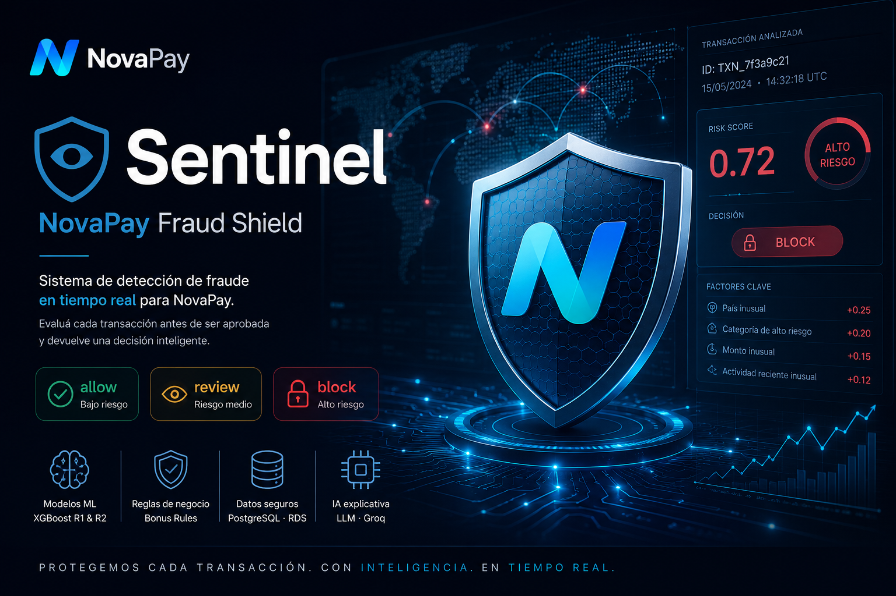

# Sentinel — NovaPay Fraud Shield



Sistema de detección de fraude en tiempo real...

Sistema de detección de fraude en tiempo real para NovaPay. Evalúa cada transacción antes de ser aprobada y devuelve una decisión (**allow / review / block**) junto con un score de riesgo, nivel de riesgo y timestamp.

---

## Equipo de Data Science

- **EDA:** Análisis exploratorio del dataset PaySim (UCI), detección de patrones de fraude, balanceo de países y categorías de alto riesgo.
- **Modelos:** Entrenamiento y validación de dos clasificadores XGBoost (R1 y R2) con umbralización optimizada por F2-Score.
- **Scoring:** Pipeline híbrido ML + Bonus Rules integrado en la API REST.
- **API REST:** Desarrollo y despliegue con FastAPI, validación de entrada con Pydantic, rate limiting y autenticación por API Key.
- **Persistencia:** Base de datos PostgreSQL en AWS RDS (Supabase), con pool de conexiones y operaciones CRUD sobre transacciones y perfiles de cliente.
- **LLM:** Integración con Groq (Llama 3.3-70b) para explicabilidad de decisiones de fraude.
- **Infraestructura:** Despliegue en AWS EC2 con Docker, RDS en región Madrid (`eu-south-2`).

---

## Arquitectura general

```
Transacción entrante (JSON)
        ↓
POST /fraud/decide
        ↓
Pipeline ML (XGBoost)  →  score_ml
        ↓
apply_bonus_rules()    →  score_final
        ↓
decision_from_score()
        ↓
allow / review / block
        ↓
Supabase (PostgreSQL · AWS RDS)
```

El sistema combina el score del modelo con reglas de negocio explícitas (bonus rules) que suman al score según patrones conocidos de fraude no capturados en el entrenamiento.

### Arquitectura del servidor

```
                    ┌────────────────────────────────────────┐
                    │       FastAPI Core (main.py)           │
                    │  Puerto 8000                           │
                    └───────────────────┬────────────────────┘
                                        │
           ┌────────────────────────────┼────────────────────────────┐
           ▼                            ▼                            ▼
┌──────────────────────┐    ┌──────────────────────┐    ┌──────────────────────┐
│   Router de Fraude   │    │  Router de Métricas  │    │ Router de Metadatos  │
│  (routes/fraud.py)   │    │  (routes/stats.py)   │    │  (routes/meta.py)    │
└──────────┬───────────┘    └──────────┬───────────┘    └──────────────────────┘
           │                           │
           ▼                           ▼
┌──────────────────────┐    ┌──────────────────────┐
│    Motor de Scoring  │    │   Stats desde         │
│     (scoring.py)     │    │   Supabase (stats.py) │
└──────────┬───────────┘    └──────────────────────┘
           │
           ▼
┌──────────────────────┐         ┌──────────────────────┐
│  Artefactos .joblib  │         │   LLM Explainer       │
│  R1 + R2 pipelines   │         │  (llm_explainer.py)   │
└──────────────────────┘         └──────────────────────┘
           │                                │
           └───────────────┬────────────────┘
                           ▼
              ┌─────────────────────────┐
              │   Supabase (PostgreSQL) │
              │   AWS RDS eu-south-2    │
              └─────────────────────────┘
```

---

## Estructura del proyecto

```
Desafio_Grupo1/
├── api/
│   ├── main.py                         # Punto de entrada FastAPI
│   ├── limiter.py                      # Rate limiting (slowapi)
│   ├── schemas.py                      # Contratos Pydantic (input/output)
│   └── routes/
│       ├── fraud.py                    # Endpoints de detección y operaciones
│       ├── stats.py                    # Endpoints de métricas y dashboard
│       └── meta.py                     # Healthcheck y estado del sistema
├── src/
│   ├── scoring.py                      # Pipeline híbrido ML + bonus rules
│   ├── storage.py                      # CRUD sobre Supabase (pool de conexiones)
│   ├── client_profile.py               # Perfil histórico del cliente
│   └── llm_explainer.py                # Integración con Groq / Llama 3
├── models/
│   ├── xgb_fraud_pipeline.joblib       # Modelo R1
│   └── xgb_fraud_pipeline_r2.joblib    # Modelo R2
├── notebooks/
│   ├── 01_EDA.ipynb                    # Análisis exploratorio y balanceo de datos
│   ├── 02_ML.ipynb                     # Entrenamiento R1
│   ├── 03_ML_Ronda2.ipynb              # Entrenamiento R2
│   └── 05_Round2_Stealth_Fraud.ipynb   # Generación del dataset de fraude sigiloso
├── data/
│   ├── synthetic_fin_data_BALANCED.csv
│   ├── synthetic_fin_data_CLEAN.csv
│   └── synthetic_fin_data_ROUND2.csv
└── docs/
    ├── DECISIONS.md                    # Registro de decisiones técnicas
    └── Arquitectura_AWS.md             # Detalle de infraestructura AWS
```

---

## Instalación y ejecución local

```bash
# Instalar dependencias
pip install -r requirements-api.txt

# Variables de entorno necesarias (.env)
SUPABASE_DB_URL=postgresql://...
GROQ_API_KEY=gsk_...

# Arrancar API con R1 (por defecto)
uvicorn api.main:app --reload

# Arrancar con R2
MODEL_VERSION=r2 uvicorn api.main:app --port 8001 --reload
```

Documentación Swagger (solo en desarrollo):
```
http://localhost:8000/docs
```

> En producción, Swagger y ReDoc están deshabilitados (`docs_url=None`, `redoc_url=None`).

---

## Modelos en producción

| Versión | Descripción | Pipeline | Threshold |
|---|---|---|---|
| R1 | Fraude obvio: país, categoría, tipo de transacción, balances | `xgb_fraud_pipeline.joblib` | 0.45 |
| R2 | Fraude sigiloso: errores de balance, ratios de vaciado, hora cíclica | `xgb_fraud_pipeline_r2.joblib` | 0.55 |

> R2 elimina intencionalmente `ip_country` y `merchant_category` como features del modelo. El fraude sigiloso fue diseñado para camuflar estas señales, por lo que el modelo se centra en inconsistencias contables. Las señales de país y categoría se cubren mediante bonus rules.

---

## Métricas de rendimiento

### R1 — Fraude obvio (threshold 0.45)

| Métrica | Valor |
|---|---|
| Precision | 94% |
| Recall | 99% |
| ROC-AUC | 99.99% |
| Fraudes perdidos | 12 |
| Falsas alarmas | 96 |

Features: `amount`, `oldbalanceOrg`, `newbalanceOrig`, `oldbalanceDest`, `newbalanceDest`, `type`, `merchant_category`, `ip_country` (OHE).

### R2 — Fraude sigiloso (threshold 0.55)

| Métrica | Valor |
|---|---|
| Precision | 99.21% |
| Recall | 99.76% |
| F1 | 99.48% |
| ROC-AUC | 99.92% |
| Fraudes perdidos | 8 |
| Falsas alarmas | 26 |

Features: `balance_error_dest`, `drain_ratio_orig`, `dest_received_ratio`, `amount_to_orig_ratio`, `both_orig_zero`, `both_balances_zero`, `hour_sin`, `hour_cos`, `type`.

---

## Umbrales de decisión

| Score | Decisión | Risk Level |
|---|---|---|
| >= 0.80 | block | high |
| >= 0.30 | review | medium |
| < 0.30 | allow | low |

---

## Bonus Rules

Sistema de reglas de negocio que suman al score del modelo, aplicadas después del score ML.

| Regla | Bonus |
|---|---|
| País de alto riesgo (NG, KH, CN, CI, VE) | +0.10 |
| Categoría de alto riesgo (crypto, electronics) | +0.10 |
| Importe > 8.000€ | +0.10 |
| Importe > 50.000€ | +0.25 |
| Importe anómalo para la categoría | +0.20 |
| Error contable en balance origen | +0.12 |
| Error contable en balance destino | +0.12 |
| Cuenta relay (saldo 0 antes y después en operaciones de drenaje) | +0.15 |
| Combinación país + categoría de alto riesgo | +0.10 |
| Ratio de drenaje con señal de riesgo activa | +0.15 |
| Vaciado total de cuenta | +0.25 |
| Discrepancia > 50% entre amount y cambio real de balance | +0.25 |
| Cap máximo de bonus | 0.75 |

### Umbrales de importe por categoría (personas físicas)

| Categoría | Umbral |
|---|---|
| restaurant | 50.000€ |
| transport | 35.000€ |
| grocery | 3.000€ |
| fuel | 2.500€ |
| pharmacy | 2.000€ |

Electronics y crypto no tienen umbral por categoría — ya tienen bonus por ser categorías de alto riesgo.

---

## Autenticación

Todos los endpoints protegidos requieren el header:

```
X-API-Key: <api_key>
```

Sin este header se devuelve `403 Forbidden`.

---

## Rate limiting

El endpoint `/fraud/decide` está limitado a **30 requests por minuto** por IP mediante `slowapi`. Superar el límite devuelve `429 Too Many Requests`.

---

## Endpoints

### Módulo de detección y operaciones (`/fraud`)

| Método | Endpoint | Auth | Función |
|---|---|---|---|
| POST | `/fraud/decide` | ✅ | Decisión de fraude en tiempo real |
| GET | `/fraud/queue` | ✅ | Cola de casos pendientes de revisión |
| POST | `/fraud/decide/preview` | ❌ | Simulación de impacto de umbrales |
| POST | `/fraud/challenge` | ❌ | Recomendación adaptativa de fricción |
| POST | `/fraud/feedback` | ✅ | Cierre de caso por analista |
| GET | `/fraud/client/{nameOrig}` | ✅ | Perfil histórico del cliente |
| GET | `/fraud/explain/{transaction_id}` | ❌ | Explicación LLM de la decisión |

### Módulo de métricas (`/data`)

| Método | Endpoint | Auth | Función |
|---|---|---|---|
| GET | `/data/stats` | ❌ | Estadísticas globales del dashboard |

### Módulo de metadatos (`/meta`)

| Método | Endpoint | Auth | Función |
|---|---|---|---|
| GET | `/meta/health` | ❌ | Estado de la API y la base de datos |

---

## Referencia de endpoints

### `POST /fraud/decide`

Decisión de fraude en tiempo real. Rate limit: 30/min.

**Request:**
```json
{
  "transaction_id": "TXN-001",
  "step": 10,
  "type": "TRANSFER",
  "amount": 500.00,
  "nameOrig": "C123456789",
  "oldbalanceOrg": 5000.00,
  "newbalanceOrig": 4500.00,
  "nameDest": "M987654321",
  "oldbalanceDest": 1000.00,
  "newbalanceDest": 1500.00,
  "merchant_category": "grocery",
  "ip_country": "ES",
  "hour_of_the_day": 10
}
```

**Response `200 OK`:**
```json
{
  "transaction_id": "TXN-001",
  "decision": "allow",
  "fraud_probability": 0.0119,
  "risk_level": "low",
  "timestamp": "2026-05-28T10:00:00Z"
}
```

---

### `GET /fraud/queue`

Cola de casos pendientes de revisión.

**Query params:** `limit` (default 50, max 200), `risk_level` (low/medium/high)

**Response `200 OK`:**
```json
{
  "total_pending": 12,
  "queue": [
    {
      "transaction_id": "TXN-001",
      "amount": 183806.32,
      "type": "CASH_OUT",
      "ip_country": "US",
      "merchant_category": "financial",
      "fraud_probability": 0.54,
      "risk_level": "medium",
      "timestamp": "2026-05-28T10:34:00Z"
    }
  ]
}
```

---

### `POST /fraud/feedback`

Cierre del caso por analista.

**Request:**
```json
{
  "transaction_id": "TXN-001",
  "analyst_decision": "fraud",
  "analyst_notes": "Confirmado por usuario",
  "analyst_id": "analyst_42"
}
```

**Response `200 OK`:**
```json
{
  "status": "stored",
  "case_id": "case_a1b2c3d4",
  "transaction_id": "TXN-001",
  "decision": "fraud"
}
```

---

### `GET /fraud/client/{nameOrig}`

Perfil histórico del cliente consultando Supabase directamente.

**Response `200 OK`:**
```json
{
  "client_id": "C123456789",
  "stats": {
    "total_transactions": 15,
    "total_volume": 42500.00,
    "avg_amount": 2833.33,
    "max_amount": 12000.00,
    "first_seen": "2026-01-10T08:00:00Z",
    "last_seen": "2026-05-28T10:00:00Z",
    "fraud_rate_historical": 0.0667,
    "distinct_counterparties": 8,
    "most_used_type": "TRANSFER"
  }
}
```

---

### `GET /fraud/explain/{transaction_id}`

Explicación en lenguaje natural generada por Llama 3.3-70b vía Groq. Solo invocar a demanda (latencia ~2-3s).

**Response `200 OK`:**
```json
{
  "narrative": "La transacción presenta alto riesgo por la discrepancia matemática en el balance origen, que pasa de 600.000 a 100.000 con un importe de 500.000. El país de la IP es Nigeria, factor de riesgo adicional. La categoría electronics en combinación con el vaciado casi total de cuenta activa múltiples señales del sistema."
}
```

---

### `GET /data/stats`

Estadísticas globales para el dashboard, calculadas en tiempo real desde Supabase.

**Response `200 OK`:**
```json
{
  "total_transactions": 10000,
  "fraud_detected": 450,
  "global_fraud_rate": 0.045,
  "top_dangerous_countries": [
    {"country": "NG", "fraud_cases": 120}
  ],
  "top_dangerous_categories": [
    {"category": "crypto", "fraud_cases": 85}
  ],
  "amount_stats": {
    "average": 15420.50,
    "max": 999000.00,
    "min": 10.00
  }
}
```

---

### `GET /meta/health`

Estado de la API y la base de datos.

**Response `200 OK`:**
```json
{
  "status": "up",
  "database": "ok",
  "version": "1.0.0"
}
```

---

## Validaciones de entrada

| Campo | Regla |
|---|---|
| `transaction_id` | String, 1-50 caracteres, sin `< > " ' % ; ( ) & +` |
| `amount` | Float, mínimo 10.0, máximo 1.000.000 |
| `nameOrig` / `nameDest` | `C` o `M` + 8 a 10 dígitos (ej. `C123456789`, `M987654321`) |
| `type` | `TRANSFER`, `CASH_OUT`, `PAYMENT`, `DEBIT`, `CASH_IN` |
| `step` | Entero, 1-744 (horas, máximo 31 días) |
| `ip_country` | Código ISO 3166-1 alpha-2 (ej. `ES`, `NG`) o `UNKNOWN` |
| `merchant_category` | `crypto`, `electronics`, `restaurant`, `pharmacy`, `grocery`, `transport`, `fuel`, `financial`, `unknown` |
| `hour_of_the_day` | Entero, 0-23 (opcional) |
| `nameOrig` ≠ `nameDest` | No pueden ser el mismo cliente |

Requests inválidos reciben `422 Unprocessable Entity` sin consumir recursos del pipeline ML.

---

## Módulo LLM

- **Proveedor:** Groq LPU
- **Modelo:** `llama-3.3-70b-versatile`
- **Temperatura:** 0.2
- **Max tokens:** 150
- **Privacidad:** los datos se anonimizan antes de enviarse — no se transmiten IDs de clientes reales
- **Fallo silencioso:** si Groq no está disponible, el endpoint devuelve un mensaje de error sin romper la API

Variable de entorno requerida: `GROQ_API_KEY=gsk_...`

---

## Base de datos

**Motor:** PostgreSQL 16 · **Servicio:** AWS RDS (`eu-south-2` — Madrid) · **Variable:** `SUPABASE_DB_URL`

| Tabla | Descripción |
|---|---|
| `Transactions` | Log histórico de todas las transacciones procesadas |
| `ClientProfiles` | Perfil agregado por cliente (upsert automático) |

| Función (`storage.py`) | Descripción |
|---|---|
| `save_transaction()` | Inserta transacción y hace upsert del perfil del cliente |
| `get_pending_queue()` | Devuelve transacciones con `status=pending` |
| `resolve_case()` | Actualiza una transacción a `status=reviewed` con decisión del analista |

---

## Infraestructura AWS

| Componente | Servicio | Configuración |
|---|---|---|
| API | EC2 + Docker | Instancia en `eu-south-2` |
| Base de datos | RDS PostgreSQL 16 | `db.t3.micro`, 20 GB gp3, sin acceso público |
| Red | VPC + Security Groups | RDS solo accesible desde el security group de EC2 |
| Backups | RDS automático | Retención 7 días |
| Cifrado | AWS KMS | En reposo y en tránsito |

Para el detalle completo, ver [`docs/Arquitectura_AWS.md`](docs/Arquitectura_AWS.md).

---

## Códigos de error

| Código | Causa |
|---|---|
| `200 OK` | Petición exitosa |
| `403 Forbidden` | API Key inválida o faltante |
| `404 Not Found` | Recurso no encontrado |
| `422 Unprocessable Entity` | Validación de Pydantic fallida |
| `429 Too Many Requests` | Rate limit superado (30/min en `/fraud/decide`) |
| `500 Internal Server Error` | Error interno del servidor o base de datos |

---

## Datasets

| Archivo | Descripción |
|---|---|
| `synthetic_fin_data_BALANCED.csv` | Países de alto riesgo balanceados al 25% de fraude |
| `synthetic_fin_data_CLEAN.csv` | Países y categorías balanceados. Base de entrenamiento R1 |
| `synthetic_fin_data_ROUND2.csv` | Fraude sigiloso generado sintéticamente. Base de entrenamiento R2 |

---

## Notebooks

| Notebook | Contenido |
|---|---|
| `01_EDA.ipynb` | Análisis exploratorio, detección de sesgos, balanceo de datos |
| `02_ML.ipynb` | Entrenamiento R1: XGBoost, threshold tuning, métricas |
| `03_ML_Ronda2.ipynb` | Entrenamiento R2: feature engineering, threshold tuning, métricas |
| `05_Round2_Stealth_Fraud.ipynb` | Generación del dataset de fraude sigiloso para R2 |

---

## Decisiones técnicas clave

El registro completo está en [`docs/DECISIONS.md`](docs/DECISIONS.md). Las más relevantes:

- **XGBoost sobre SMOTE:** Se usa `scale_pos_weight` para el desbalance de clases. SMOTE genera perfiles imposibles en variables categóricas codificadas.
- **OHE sobre TargetEncoder para ip_country en R1:** El TargetEncoder embebía la probabilidad de fraude por país directamente, causando sesgo determinista con el dataset desbalanceado.
- **R2 sin ip_country ni merchant_category:** El fraude sigiloso camufla estas señales. El modelo R2 se entrena solo con comportamiento financiero; las señales externas se cubren por bonus rules.
- **Hora cíclica (sin/cos):** La hora del día es una variable cíclica. Sin/cos preserva la continuidad entre hora 23 y hora 0.
- **F2-Score como métrica de optimización:** En detección de fraude, un falso negativo es más costoso que un falso positivo. F2 da doble peso al recall.
